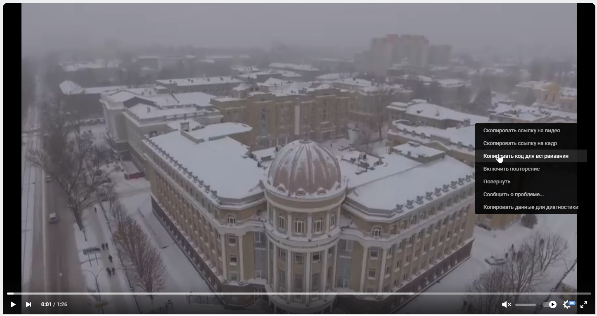

* [Видео](#Видео)
* * [В контакте (Как получить корректную ссылку)](#В-контакте-(Как-получить-корректную-ссылку))
* [Новости](#Новости)
    * [Генерация url](#Генерация-url)
        * [Подразделения](#Подразделения)

# Видео

## В контакте (Как получить корректную ссылку)

**Способ 1**

Допустим у нас есть ссылка на видео с сайта VK  ```(https://vk.com/video-24533364_456241696)``` нам необходимо получить прямую ссылку на видео.

Прямая ссылка на видео выглядит следующим образом ```https://vk.com/video_ext.php?oid=-24533364&id=456241696```

Реализовывеам ссылку сами!

Берем образец ``` https://vk.com/video_ext.php?oid=-``` из основной ссылки берем oid он находится после ```https://vk.com/video-```, в данной ситуации 24533364.
У нас получилась ссылка ```https://vk.com/video_ext.php?oid=-24533364```, далее нам необходимо добавить id, для склейки oid и id мы используем спецсимовол &: ```https://vk.com/video_ext.php?oid=-24533364&id=```, как мы видим из основной ссылки id находится после символа **_**, добавив id у нас получится  ```https://vk.com/video_ext.php?oid=-24533364&id=456241696```

**Способ 2**

Кликаем по видео пкм и выбираем "Копировать код для встраивания".



Мы получим следующий frame

```html
<iframe 
    src="https://vk.com/video_ext.php?oid=-24533364&id=456241696&hash=eac4f4c94bdcb684" 
    width="640" 
    height="360" 
    frameborder="0" 
    allowfullscreen="1" 
    allow="autoplay; encrypted-media; fullscreen; picture-in-picture">
</iframe>
```

Копируем значение **src=** не включая данные hash ```&hash=eac4f4c94bdcb684``` и в результате мы получаем корректную ссылку ```https://vk.com/video_ext.php?oid=-24533364&id=456241696```


# Новости

## Генерация url

### Подразделения

Новость относится к подразделению, если у новости поле **"Связь с подразделением"** не пустое!

> Обратите внимание, если **"Связь с подразделением"** не указана, то новость будет относиться к общим новостям СГУ, а не к конкретному подразделению.


При первом сохранении новости (если указана **"Связь с подразделением"**) система автоматически создаёт постоянную ссылку (URL):

```
https://sgu.ru/struktura/(краткое название подразделения)/news/(год)/(название-новости)
```

Пример ссылки на новость для подразделения "Управление цифровых и информационных технологий":

```
https://sgu.ru/struktura/cdto/news/2026/testovaya-novost
```
- sgu.ru - имя сайта
- struktura - Структура университета
- cdto - Элемент пути (краткое название подразделения, элемент пути должен быть написан латинскими буквами и без пробелов)
- news - указывает, что новость
- 2026 - текущий год
- testovaya-novost - название новости


**Случай, когда новость существует, но ссылка не верная.**

Открываем новость нашего подразделения.
Нужно убедиться, что поле **"Связь с подразделением"** не пустое.


В настройках убедидесь, что в "Синоним URL" установлена галочка в "Создать синоним URL автоматически" (она установлена по умолчанию).


После сохранения сгенерируется следующая ссылка 
```
https://sgu.ru/struktura/znb_sgu/news/2026/anons-meropriyatiy-na-yanvar
```

> Обратите внимание, что год генерируется **текущий**, если статья опубликована в прошлом году или ранее, то необходимо изменить ссылку новости в ручную. В данном случаи в настройках (Синоним URL (Автоматический синоним)) убираем галочку.


