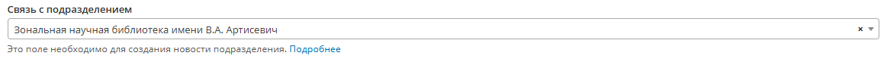
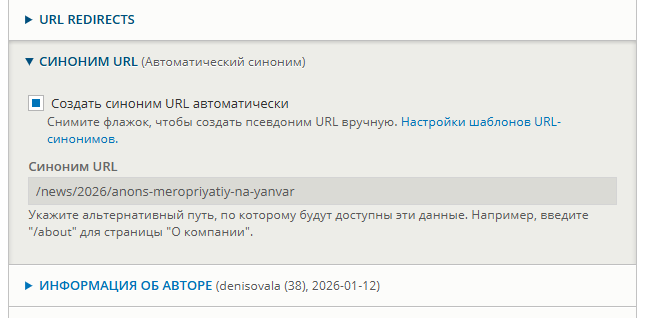

* <a name="news">Новости</a>
    * <a name="url-generation">Генерация url</a>
        * <a name="divisions">Подразделения</a>

# [Новости](#news)

## [Генерация url](#url-generation)

### [Подразделения](#divisions)

Новость относится к подразделению, если у новости поле "Связь с подразделением" не пустое.


При первичном сохранении новости, url генерируется автоматически.
Для подразделения "Управление цифровых и информационных технологий", ссылка сгенерируется в следующем формате

```
sgu.ru/struktura/cdto/news/2026/testovaya-novost

sgu.ru - имя сайта
struktura - Структура университета
cdto - Элемент пути (устанавливается на странице подразделения, элемент пути должен быть написан латинскими буквами и без пробелов)
news - указывает, что новость
2026 - текущий год
testovaya-novost - название новости
```

**Случай, когда новость существует, но ссылка не верная.**

Открываем новость нашего подразделения.
Нужно убедиться, что поле "Связь с подразделением" не пустое.




В настройках убедидесь, что галочка установлена в "Синоним URL (Автоматический синоним)"


После сохранения сгенерируется следующая ссылка 
```
https://sgu.ru/struktura/znb_sgu/news/2026/anons-meropriyatiy-na-yanvar
```

Обратите внимание, что год генерируется текущий, если статья опубликована в прошлом году и ранее, то можно зайти и изменить ссылку новости в ручную. В данном случаи в настройках (Синоним URL (Автоматический синоним)) галочка не должна быть установлена 


